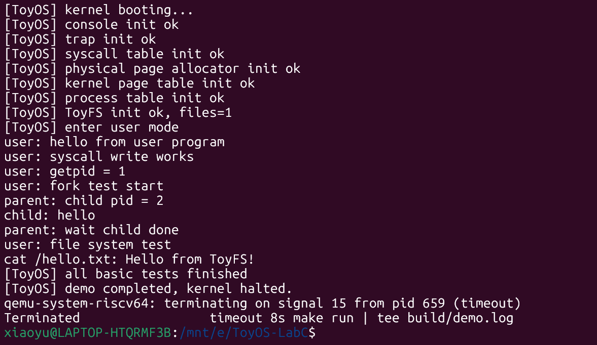
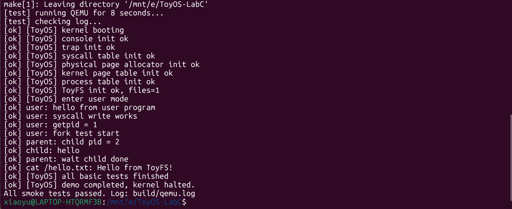

# ToyOS-LabC By 71124132 钱笑誉

> 一个运行在 QEMU RISC-V64 `virt` 平台上的教学型小操作系统实验项目。  

> 这个项目将从这一条操作系统运行链路运行：它首先在 QEMU RISC-V64 平台上启动 ToyOS 内核，然后完成控制台、Trap、系统调用、内存页、页表、进程表和 ToyFS 的初始化。初始化完成后进入用户程序阶段，用户程序通过系统调用请求内核服务，完成输出、获取进程号、fork/wait 父子进程测试和 ToyFS 文件读取测试。所以它的是把操作系统中的用户态/内核态、系统调用、内存管理、进程管理和文件系统抽象串成一个可运行、可展示、可自动测试的教学型系统。

---

## 1. 项目理解

ToyOS-LabC 可以理解为：

```text
QEMU 模拟一台 RISC-V64 机器
        ↓
OpenSBI 把控制权交给 ToyOS 内核
        ↓
ToyOS 完成内核初始化
        ↓
进入用户程序阶段
        ↓
用户程序通过系统调用请求内核服务
        ↓
完成输出、获取 pid、fork/wait、ToyFS 文件读取等测试
```

也就是说，本项目主要展示的是操作系统最核心的一条运行链路：

```text
内核启动
  → 控制台输出
  → Trap / Syscall
  → 内存页与页表
  → 进程管理
  → 用户程序
  → ToyFS 文件读取
  → 自动化测试
```

---

## 以 `write()` 系统调用为例

在 ToyOS-LabC 中，`trap` 是用户态进入内核态的统一入口机制。用户程序不能直接访问内核数据结构、页表、设备和进程表，因此当用户程序需要输出字符、退出进程、创建进程、读文件等服务时，需要通过系统调用进入内核。

以 `write()` 系统调用为例，它的完整执行流程如下：

```text
用户程序调用 write()
    ↓
user/syscall.c 中的 write() 封装函数
    ↓
do_syscall() 将参数放入 a0-a5，将系统调用号放入 a7
    ↓
执行 ecall 指令
    ↓
CPU 触发 trap，跳转到 stvec 指向的 trap_entry
    ↓
trapvec.S 保存用户态寄存器到 trapframe
    ↓
切换到内核页表和内核栈
    ↓
调用 trap_dispatch()
    ↓
trap_dispatch() 根据 scause 判断这是用户态 ecall
    ↓
调用 syscall_dispatch()
    ↓
syscall_dispatch() 根据 a7 中的系统调用号找到 SYS_write
    ↓
调用 sys_write()
    ↓
sys_write() 从用户地址空间读取字符串，并通过 console_putchar() 输出
    ↓
返回值写回 trapframe->a0
    ↓
trap_return() 和 userret 恢复用户现场
    ↓
sret 返回用户态
```

---

### 1. 用户态 `write()` 封装

用户程序调用的 `write()` 并不会直接访问终端设备，而是调用 `do_syscall()`，通过 `ecall` 主动陷入内核。

```c
// user/syscall.c

static long do_syscall(long num,
                       long a0, long a1, long a2,
                       long a3, long a4, long a5) {
    register long x0 asm("a0") = a0;
    register long x1 asm("a1") = a1;
    register long x2 asm("a2") = a2;
    register long x3 asm("a3") = a3;
    register long x4 asm("a4") = a4;
    register long x5 asm("a5") = a5;
    register long x7 asm("a7") = num;

    asm volatile("ecall"
                 : "+r"(x0)
                 : "r"(x1), "r"(x2), "r"(x3),
                   "r"(x4), "r"(x5), "r"(x7)
                 : "memory");

    return x0;
}

long write(int fd, const void *buf, int n) {
    return do_syscall(SYS_write, fd, (long)buf, n, 0, 0, 0);
}
```

其中：

```text
a0 = fd
a1 = buf
a2 = n
a7 = SYS_write
```

ToyOS 使用 RISC-V 常见的系统调用约定：
参数放在 `a0-a5`，系统调用号放在 `a7`，返回值放回 `a0`。

---

### 2. 系统调用号定义

`SYS_write` 在 `include/syscall.h` 中定义。用户态和内核态都使用同一套系统调用编号。

```c
// include/syscall.h

#ifndef TOYOS_SYSCALL_H
#define TOYOS_SYSCALL_H

#define SYS_write    1
#define SYS_exit     2
#define SYS_getpid   3
#define SYS_yield    4
#define SYS_fork     5
#define SYS_wait     6
#define SYS_exec     7
#define SYS_readfile 8
#define SYS_info     9

#endif
```

因此，当用户程序执行：

```c
write(1, "hello\n", 6);
```

本质上就是：

```text
把 fd = 1 放入 a0
把字符串地址放入 a1
把长度 6 放入 a2
把 SYS_write = 1 放入 a7
执行 ecall
```

---

### 3. Trap 初始化：设置入口地址

内核启动时会调用 `trapinit()`，把汇编入口 `trap_entry` 写入 RISC-V 的 `stvec` 寄存器。

```c
// kernel/trap.c

void trapinit(void) {
    w_stvec((uint64)trap_entry);
}
```

`stvec` 的作用是保存 trap 入口地址。之后只要发生系统调用、异常或中断，CPU 就会跳转到 `trap_entry`。

---

### 4. 汇编入口保存用户现场

`trap_entry` 位于 `kernel/trapvec.S`。当用户程序执行 `ecall` 后，CPU 会跳到这里。

核心工作包括：

1. 保存用户态寄存器；
2. 保存 `sepc` 和 `sstatus`；
3. 切换到内核页表；
4. 切换到内核栈；
5. 调用 C 语言的 `trap_dispatch()`。

关键代码片段如下：

```asm
// kernel/trapvec.S

.globl trap_entry
trap_entry:
    csrrw sp, sscratch, sp

    sd ra, TF_RA(sp)
    sd gp, TF_GP(sp)
    sd tp, TF_TP(sp)

    sd a0, TF_A0(sp)
    sd a1, TF_A1(sp)
    sd a2, TF_A2(sp)
    sd a3, TF_A3(sp)
    sd a4, TF_A4(sp)
    sd a5, TF_A5(sp)
    sd a6, TF_A6(sp)
    sd a7, TF_A7(sp)

    csrr t0, sscratch
    sd t0, TF_SP(sp)

    csrr t0, sepc
    sd t0, TF_EPC(sp)

    csrr t0, sstatus
    sd t0, TF_STATUS(sp)

    ld t0, TF_KERNEL_SATP(sp)
    csrw satp, t0
    sfence.vma

    ld sp, TF_KERNEL_SP(sp)

    call trap_dispatch
    call trap_return
```

其中最关键的是保存 `a0-a7`，因为系统调用参数和系统调用号都在这些寄存器里。保存之后，内核就可以通过当前进程的 `trapframe` 读取这些值。

---

### 5. trapframe：保存用户态现场

`trapframe` 是 trap 机制中非常重要的数据结构。它用来保存用户程序被 trap 打断时的寄存器状态。

```c
// include/proc.h

struct trapframe {
    uint64 ra;
    uint64 gp;
    uint64 tp;

    uint64 t0;
    uint64 t1;
    uint64 t2;

    uint64 s0;
    uint64 s1;

    uint64 a0;
    uint64 a1;
    uint64 a2;
    uint64 a3;
    uint64 a4;
    uint64 a5;
    uint64 a6;
    uint64 a7;

    uint64 s2;
    uint64 s3;
    uint64 s4;
    uint64 s5;
    uint64 s6;
    uint64 s7;
    uint64 s8;
    uint64 s9;
    uint64 s10;
    uint64 s11;

    uint64 t3;
    uint64 t4;
    uint64 t5;
    uint64 t6;

    uint64 sp;
    uint64 kernel_sp;
    uint64 epc;
    uint64 status;
    uint64 kernel_satp;
};
```

对于 `write()` 系统调用来说，最关键的字段是：

```text
trapframe->a0：文件描述符 fd
trapframe->a1：用户缓冲区地址 buf
trapframe->a2：写入长度 n
trapframe->a7：系统调用号 SYS_write
trapframe->epc：返回用户态后继续执行的位置
```

---

### 6. trap_dispatch：判断 trap 类型

进入 C 层后，`trap_dispatch()` 会读取 `scause`，判断 trap 的原因。

```c
// kernel/trap.c

void trap_dispatch(struct trapframe *tf) {
    struct proc *p = myproc();

    if (p == NULL) {
        panic("trap without current process");
    }

    uint64 scause = r_scause();
    uint64 code = scause & ~SCAUSE_INTERRUPT;

    if ((scause & SCAUSE_INTERRUPT) == 0 && code == 8) {
        tf->epc += 4;
        syscall_dispatch();
        return;
    }

    if ((scause & SCAUSE_INTERRUPT) && code == 5) {
        printf("[ToyOS] timer interrupt pid=%d\n", p->pid);
        proc_yield();
        return;
    }

    if ((scause & SCAUSE_INTERRUPT) == 0) {
        if (code == 2) {
            printf("[ToyOS] illegal instruction in pid=%d epc=%p stval=%p\n",
                   p->pid, (void *)tf->epc, (void *)r_stval());
        } else if (code == 12 || code == 13 || code == 15) {
            printf("[ToyOS] page fault in pid=%d scause=%x epc=%p stval=%p\n",
                   p->pid, scause, (void *)tf->epc, (void *)r_stval());
        } else {
            printf("[ToyOS] unexpected trap pid=%d scause=%x epc=%p stval=%p\n",
                   p->pid, scause, (void *)tf->epc, (void *)r_stval());
        }

        proc_exit(-1);
    }

    printf("[ToyOS] unhandled interrupt scause=%x\n", scause);
}
```

这里：

```c
code == 8
```

表示这是用户态执行 `ecall` 触发的系统调用。

这一句非常关键：

```c
tf->epc += 4;
```

因为 `epc` 保存的是触发 trap 的那条 `ecall` 指令地址。如果不加 4，系统调用返回用户态后还会继续执行同一条 `ecall`，导致反复陷入内核，形成死循环。所以这里要让 `epc` 跳过当前的 `ecall` 指令。

---

### 7. syscall_dispatch：根据 a7 分发系统调用

当 `trap_dispatch()` 判断这是系统调用后，会调用：

```c
syscall_dispatch();
```

在 `kernel/syscall.c` 中，内核通过当前进程的 `trapframe->a7` 取出系统调用号。

```c
// kernel/syscall.c

void syscall_dispatch(void) {
    struct proc *p = myproc();
    int num = (int)p->trapframe->a7;
    int ret = -1;

    switch (num) {
    case SYS_write:
        ret = sys_write();
        break;
    case SYS_exit:
        ret = sys_exit();
        break;
    case SYS_getpid:
        ret = sys_getpid();
        break;
    case SYS_yield:
        ret = sys_yield();
        break;
    case SYS_fork:
        ret = sys_fork();
        break;
    case SYS_wait:
        ret = sys_wait();
        break;
    case SYS_exec:
        ret = sys_exec();
        break;
    case SYS_readfile:
        ret = sys_readfile();
        break;
    case SYS_info:
        ret = sys_info();
        break;
    default:
        printf("[ToyOS] unknown syscall %d from pid=%d\n", num, p->pid);
        ret = -1;
        break;
    }

    p->trapframe->a0 = (uint64)ret;
}
```

对于 `write()` 来说：

```text
trapframe->a7 == SYS_write
```

所以会进入：

```c
case SYS_write:
    ret = sys_write();
    break;
```

处理完成后，返回值会写入：

```c
p->trapframe->a0 = (uint64)ret;
```

这样用户态 `write()` 返回时，就可以从 `a0` 中拿到返回值。

---

### 8. sys_write：真正完成输出

`sys_write()` 是内核侧真正处理 `write()` 系统调用的函数。

```c
// kernel/syscall.c

static uint64 argraw(int n) {
    struct trapframe *tf = myproc()->trapframe;

    switch (n) {
    case 0:
        return tf->a0;
    case 1:
        return tf->a1;
    case 2:
        return tf->a2;
    case 3:
        return tf->a3;
    case 4:
        return tf->a4;
    case 5:
        return tf->a5;
    default:
        return 0;
    }
}
```

`argraw()` 的作用是从 `trapframe` 中读取系统调用参数。

对于：

```c
write(1, "hello\n", 6);
```

对应关系是：

```text
argraw(0) = fd = 1
argraw(1) = ubuf = 用户态字符串地址
argraw(2) = n = 6
```

`sys_write()` 的代码如下：

```c
// kernel/syscall.c

static int sys_write(void) {
    int fd = (int)argraw(0);
    uint64 ubuf = argraw(1);
    int n = (int)argraw(2);

    if (fd != 1 && fd != 2) {
        return -1;
    }

    if (n < 0) {
        return -1;
    }

    for (int i = 0; i < n; i++) {
        char ch;

        if (copyin(myproc()->pagetable, &ch, ubuf + (uint64)i, 1) != 0) {
            return -1;
        }

        console_putchar(ch);
    }

    return n;
}
```

这里有两个重要细节：

第一，`write()` 只允许输出到标准输出或标准错误：

```c
if (fd != 1 && fd != 2) {
    return -1;
}
```

第二，用户传进来的 `buf` 是用户地址空间里的地址，内核不能直接当作普通指针访问，而是要通过：

```c
copyin(myproc()->pagetable, &ch, ubuf + (uint64)i, 1)
```

从用户页表中安全地拷贝数据。

每成功拷贝一个字符，就调用：

```c
console_putchar(ch);
```

把字符输出到控制台。

---

### 9. 返回用户态

系统调用处理完成后，`trap_return()` 会准备返回用户态。

```c
// kernel/trap.c

void trap_return(void) {
    struct proc *p = myproc();

    if (p == NULL || p->trapframe == NULL) {
        panic("trap_return without process");
    }

    w_stvec((uint64)trap_entry);

    uint64 x = p->trapframe->status;
    x &= ~SSTATUS_SPP;
    x |= SSTATUS_SPIE;
    p->trapframe->status = x;

    p->trapframe->kernel_sp = (uint64)p->kstack + PGSIZE;
    p->trapframe->kernel_satp = make_satp(kernel_pagetable_get());

    userret(p->trapframe, make_satp(p->pagetable));
}
```

这里：

```c
x &= ~SSTATUS_SPP;
```

表示返回后进入用户态。

```c
x |= SSTATUS_SPIE;
```

表示返回用户态后恢复中断使能状态。

最后调用：

```c
userret(p->trapframe, make_satp(p->pagetable));
```

切回用户进程页表，并恢复用户寄存器。

---

### 10. userret：恢复现场并执行 sret

`userret` 位于 `trapvec.S`，负责恢复用户态现场并执行 `sret`。

```asm
// kernel/trapvec.S

.globl userret
userret:
    csrw satp, a1
    sfence.vma

    mv t0, a0

    ld t1, TF_EPC(t0)
    csrw sepc, t1

    ld t1, TF_STATUS(t0)
    csrw sstatus, t1

    csrw sscratch, t0

    ld sp, TF_SP(t0)

    ld ra, TF_RA(t0)
    ld a0, TF_A0(t0)
    ld a1, TF_A1(t0)
    ld a2, TF_A2(t0)
    ld a3, TF_A3(t0)
    ld a4, TF_A4(t0)
    ld a5, TF_A5(t0)
    ld a6, TF_A6(t0)
    ld a7, TF_A7(t0)

    sret
```

执行到 `sret` 后，CPU 就会从内核态返回用户态，并从 `sepc` 指向的位置继续执行。由于前面在 `trap_dispatch()` 中已经执行了：

```c
tf->epc += 4;
```

所以返回后不会重复执行 `ecall`，而是继续执行系统调用之后的用户代码。

---

### 11. 总结

以 `write()` 为例，ToyOS-LabC 的 trap + syscall 机制可以总结为：

```text
write()
    ↓
do_syscall()
    ↓
ecall
    ↓
trap_entry 保存现场
    ↓
trap_dispatch 判断 scause
    ↓
syscall_dispatch 根据 a7 分发
    ↓
sys_write 通过 copyin 读取用户缓冲区
    ↓
console_putchar 输出字符
    ↓
返回值写入 a0
    ↓
trap_return / userret 恢复现场
    ↓
sret 返回用户态
```

所以，trap 的核心作用就是：
**让用户程序以受控、安全的方式进入内核，请求内核提供系统服务。**

在 `write()` 这个例子中，用户程序只是执行了一个普通的 `write()` 函数，但背后实际上经历了：

```text
用户态函数封装
参数寄存器传递
ecall 触发 trap
汇编保存现场
C 层 trap 分发
系统调用分发
内核安全访问用户地址
控制台输出
恢复现场并返回用户态
```

这就是 ToyOS-LabC 中系统调用和 trap 机制的完整实现流程。


## 2. 项目定位

本项目是面向操作系统课程实验的教学型 OS 内核，目标是帮助理解：

1. 操作系统如何从 RISC-V 平台启动；
2. 内核为什么需要自己的输出和格式化打印；
3. 用户程序为什么不能直接访问内核资源；
4. 系统调用如何完成用户态到内核态的受控切换；
5. 内核如何管理物理页和页表；
6. 操作系统如何抽象进程、父子进程和等待机制；
7. 文件系统如何把路径和文件内容抽象给用户程序；
8. 如何通过 QEMU 和自动化脚本完成可重复验收。

本项目采用轻量化实现方式，重点展示“原理闭环”和“可验收链路”，而不是追求生产级通用操作系统的完整功能。

---

## 3. 项目大框架

可以从三层理解本项目：

```text
┌───────────────────────────────────────┐
│ 用户程序层 user/                       │
│ init、sh、hello、forkdemo、cat         │
│                                       │
│ 通过 syscall 请求内核服务               │
└───────────────────┬───────────────────┘
                    │ ecall
                    ↓
┌─────────────────────────────────────────────┐
│ ToyOS 内核层 kernel/                         │
│ console、trap、syscall、kalloc、vm、proc、fs │
│                                             │
│ 管理输出、异常入口、系统调用、内存、进程和文件  │
└───────────────────┬─────────────────────────┘
                    │ 操作虚拟硬件
                    ↓
┌───────────────────────────────────────┐
│ QEMU RISC-V64 virt 平台               │
│ CPU、内存、UART 串口、OpenSBI          │
└───────────────────────────────────────┘
```

操作系统的核心是：

> 用户程序不能直接操作硬件和内核数据，所以它通过系统调用进入 ToyOS 内核；ToyOS 内核负责处理 Trap、分发系统调用、管理内存页和进程，并通过 ToyFS 向用户程序提供简单的文件读取能力。

---

## 4. 项目目录结构

```text
ToyOS-LabC/
├── Makefile                 # 编译、运行、测试入口
├── README.md                # 项目说明文档
├── docs/                    # 实验报告和课程文档
├── displays/                # 运行输出和测试截图
├── include/                 # 公共头文件
├── kernel/                  # 内核源码
├── scripts/                 # 环境检查、QEMU 运行和测试脚本
└── user/                    # 用户态程序源码
```

各目录作用如下：

| 目录/文件 | 作用 |
|---|---|
| `Makefile` | 统一管理内核、用户程序的编译和 QEMU 运行。 |
| `kernel/` | 内核主体代码，包括启动、输出、Trap、系统调用、内存管理、进程管理、文件系统等。 |
| `include/` | 公共头文件，定义类型、常量、内存布局、系统调用号和函数声明。 |
| `user/` | 用户态测试程序，例如 `init`、`sh`、`hello`、`forkdemo`、`cat`。 |
| `scripts/` | 运行辅助脚本和 smoke test 自动化测试脚本。 |
| `docs/` | 实验报告和项目说明材料。 |
| `displays/` | 保存运行截图和测试截图，便于验收展示。 |
| `build/` | 编译产物目录，通常由 `make` 自动生成，不需要手动维护。 |

---

## 5. 运行环境

项目在以下环境中进行验证：

- Windows + WSL Ubuntu
- `qemu-system-riscv64`
- `riscv64-linux-gnu-gcc`
- GNU Make

Ubuntu / WSL 下可以使用以下命令安装依赖：

```sh
sudo apt update
sudo apt install -y build-essential gcc-riscv64-linux-gnu binutils-riscv64-linux-gnu qemu-system-riscv qemu-utils
```

环境检查命令：

```sh
which riscv64-linux-gnu-gcc
which qemu-system-riscv64
make --version
```

---

## 6. 编译与运行

进入项目目录：

```sh
cd /mnt/e/ToyOS-LabC
```

清理并重新编译：

```sh
make clean
make
```

编译成功后会生成：

```text
build/kernel.elf
build/kernel.bin
build/user/*.elf
```

运行 ToyOS：

```sh
make run
```

如果希望运行一段时间后自动退出，并把日志保存下来，可以使用：

```sh
timeout 8s make run | tee build/demo.log
```

说明：ToyOS 内核运行完成后会进入等待状态，不会像普通用户程序一样自动退出。因此在脚本测试或验收截图时使用 `timeout` 结束 QEMU 是正常做法。

---

## 7. 自动化测试

执行：

```sh
make test
```

自动化 smoke test 会完成以下事情：

1. 清理旧的编译产物；
2. 重新编译内核和用户程序；
3. 启动 QEMU；
4. 将串口输出保存到 `build/qemu.log`；
5. 检查关键日志是否出现；
6. 输出测试通过结果。

测试通过时，终端末尾会出现：

```text
All smoke tests passed. Log: build/qemu.log
```

这里的 smoke test 不是复杂单元测试，而是“验收链路测试”。它主要验证 ToyOS 是否能够完成从启动、初始化、用户程序运行到文件读取的完整演示流程。

---

## 8. 运行结果与日志理解

QEMU 启动后，OpenSBI 会先输出平台信息，随后 ToyOS 输出内核和用户程序运行日志。关键日志如下：

```text
[ToyOS] kernel booting...
[ToyOS] console init ok
[ToyOS] trap init ok
[ToyOS] syscall table init ok
[ToyOS] physical page allocator init ok
[ToyOS] kernel page table init ok
[ToyOS] process table init ok
[ToyOS] ToyFS init ok, files=1
[ToyOS] enter user mode
user: hello from user program
user: syscall write works
user: getpid = 1
user: fork test start
parent: child pid = 2
child: hello
parent: wait child done
user: file system test
cat /hello.txt: Hello from ToyFS!
[ToyOS] all basic tests finished
[ToyOS] demo completed, kernel halted.
```

这些日志对应的含义如下：

| 日志 | 含义 |
|---|---|
| `[ToyOS] kernel booting...` | 内核已经开始执行。 |
| `console init ok` | 控制台输出链路可用，后续可以打印调试信息。 |
| `trap init ok` | Trap 入口初始化完成，可以处理系统调用、异常和中断入口。 |
| `syscall table init ok` | 系统调用分发机制准备完成。 |
| `physical page allocator init ok` | 物理页分配器初始化完成。 |
| `kernel page table init ok` | 页表和地址映射初始化完成。 |
| `process table init ok` | 进程表初始化完成，可以管理进程。 |
| `ToyFS init ok, files=1` | ToyFS 文件系统初始化完成，当前内置 1 个文件。 |
| `enter user mode` | 进入用户程序测试阶段。 |
| `syscall write works` | 用户程序通过系统调用完成输出。 |
| `getpid = 1` | 用户程序通过系统调用获取进程号。 |
| `fork test start` | 开始测试父子进程创建。 |
| `parent: child pid = 2` | 父进程成功创建子进程。 |
| `child: hello` | 子进程成功运行。 |
| `parent: wait child done` | 父进程成功等待并回收子进程。 |
| `cat /hello.txt: Hello from ToyFS!` | 用户程序通过 ToyFS 成功读取文件。 |
| `all basic tests finished` | 基本验收链路全部完成。 |

---

## 9. 核心模块理解

### 9.1 启动入口：系统从哪里开始运行

ToyOS 运行在 QEMU RISC-V64 `virt` 平台上。QEMU 启动后，OpenSBI 先完成早期平台准备，然后把控制权交给 ToyOS 内核入口。

内核入口通常由 `kernel/entry.S` 提供。因为刚进入内核时还没有完整的 C 语言运行环境，所以需要先通过汇编设置基本执行环境，例如栈指针，然后再进入 C 语言的内核主函数。

可以这样理解：

```text
QEMU
  ↓
OpenSBI
  ↓
entry.S
  ↓
kmain
  ↓
内核初始化
```

---

### 9.2 Console：让内核能够输出

普通 C 程序可以使用 `printf`，但操作系统内核运行在裸机环境中，不能直接依赖标准 C 库，也没有现成的终端输出能力。

因此 ToyOS 自己实现了控制台输出模块。它通过 QEMU `virt` 平台提供的 UART 串口输出字符，并在此基础上实现简化版格式化输出。

这一模块的作用是：

> 让内核能够打印启动日志、初始化状态、测试结果和错误信息。

如果没有 console，内核即使运行了，也很难观察内部状态。

---

### 9.3 Trap：用户态进入内核态的入口

用户程序不能直接访问内核内部数据，也不能直接操作硬件。为了保证安全，用户程序如果需要内核服务，就必须通过系统调用进入内核。

Trap 可以理解为 CPU 从当前执行流转入内核处理程序的机制。系统调用、异常和中断都可以通过 Trap 进入内核。

在本项目中，用户程序通过 `ecall` 触发系统调用：

```text
用户程序
  ↓ ecall
Trap 入口
  ↓
系统调用分发
  ↓
具体内核服务
  ↓
返回用户程序
```

这体现了操作系统中的用户态与内核态边界。

---

### 9.4 Syscall：用户程序请求内核服务的接口

系统调用是用户程序访问内核服务的受控接口。

本项目中，用户程序可以通过系统调用完成：

- 输出字符串；
- 获取进程号；
- 创建子进程；
- 等待子进程；
- 执行新程序；
- 读取 ToyFS 文件；
- 退出进程。

可以这样理解：

> Trap 是“进入内核的大门”，Syscall 是“进入之后具体要办什么事的服务台”。

例如用户程序调用输出函数时，实际过程是：

```text
用户程序调用 write
  ↓
参数和系统调用号放入寄存器
  ↓
执行 ecall
  ↓
Trap 进入内核
  ↓
syscall 根据调用号分发到 sys_write
  ↓
console 输出字符
  ↓
返回用户态
```

---

### 9.5 内存管理：物理页与页表

操作系统需要管理内存，不能让所有程序随意访问物理地址。

ToyOS 中的内存管理主要体现两个概念：

1. **物理页分配**  
   内核以 4KB 页为单位管理可用物理内存。需要内存时分配一页，不需要时回收一页。

2. **页表与地址空间**  
   用户程序看到的是虚拟地址，CPU 通过页表把虚拟地址转换成物理地址。页表还可以设置访问权限，例如哪些页用户态可以访问，哪些页只能内核态访问。

可以这样理解：

```text
用户程序使用虚拟地址
        ↓
页表进行地址翻译和权限检查
        ↓
访问真实物理内存
```

该模块体现了操作系统中“内存抽象”和“地址空间隔离”的思想。

---

### 9.6 进程管理：程序如何运行起来

程序是静态文件，进程是程序运行起来后的实例。

ToyOS 的进程管理模块主要展示：

- 进程表；
- 进程号 pid；
- 进程状态；
- 父子进程关系；
- `fork` 创建子进程；
- `wait` 等待子进程；
- `exec` 执行用户程序；
- `exit` 退出进程。

运行日志中的这几行体现了进程机制：

```text
user: fork test start
parent: child pid = 2
child: hello
parent: wait child done
```

其含义是：

```text
父进程调用 fork
  ↓
内核创建子进程
  ↓
父进程得到 child pid
  ↓
子进程独立运行并输出 hello
  ↓
父进程 wait 等待子进程结束
```

这条链路展示了操作系统如何管理多个执行实体。

---

### 9.7 ToyFS：简易只读文件系统

ToyFS 是本项目实现的轻量级只读文件系统。

它不是完整磁盘文件系统，不涉及复杂的磁盘块、inode、目录写入和崩溃恢复，而是用一个简单的内存文件表展示文件系统最核心的抽象：

> 用户程序通过路径访问文件内容。

项目内置文件：

```text
/hello.txt
```

用户程序 `cat` 读取该文件时，完整链路为：

```text
cat 用户程序
  ↓
调用 readfile 系统调用
  ↓
ecall 进入内核
  ↓
syscall 分发到文件读取服务
  ↓
ToyFS 根据路径查找文件
  ↓
把文件内容复制给用户程序
  ↓
cat 输出文件内容
```

运行结果：

```text
cat /hello.txt: Hello from ToyFS!
```

这说明用户程序、系统调用、内核文件接口和 ToyFS 已经连通。

---

### 9.8 用户程序：从内核验证到用户态验证

`user/` 目录中的程序用于验证内核提供的服务：

| 用户程序 | 作用 |
|---|---|
| `init` | 用户态初始化入口。 |
| `sh` | 用户态程序组织入口。 |
| `hello` | 验证用户态输出和系统调用。 |
| `forkdemo` | 验证进程创建和等待。 |
| `cat` | 验证 ToyFS 文件读取。 |

这些程序体现了操作系统的核心思想：

> 内核不只是自己启动成功，还要能为用户程序提供服务。

---

## 10. 三条重点验收链路

### 10.1 `write` 链路：理解系统调用

```text
用户程序想输出字符串
  ↓
调用 write
  ↓
执行 ecall
  ↓
Trap 进入内核
  ↓
syscall 分发到 sys_write
  ↓
console 通过 UART 输出
  ↓
返回用户程序
```

这条链路说明：

- 用户程序不能直接操作设备；
- 系统调用是用户程序访问内核的接口；
- 内核负责最终输出。

---

### 10.2 `fork/wait` 链路：理解进程

```text
父进程调用 fork
  ↓
内核创建子进程
  ↓
父进程返回 child pid
  ↓
子进程返回 0 并继续运行
  ↓
子进程输出 child: hello
  ↓
父进程 wait 等待子进程结束
```

这条链路说明：

- 操作系统用进程抽象正在运行的程序；
- `fork` 体现父子进程关系；
- `wait` 体现进程退出后的资源回收。

---

### 10.3 `cat /hello.txt` 链路：理解文件系统

```text
用户程序 cat 请求读取 /hello.txt
  ↓
调用 readfile 系统调用
  ↓
进入内核
  ↓
ToyFS 查找文件
  ↓
把文件内容返回给用户程序
  ↓
用户程序输出 Hello from ToyFS!
```

这条链路说明：

- 文件系统向用户提供“路径 → 内容”的抽象；
- 用户程序不需要知道文件在内核中如何保存；
- 读文件同样需要通过系统调用进入内核。

---

## 11. 测试截图

ToyOS 运行输出：



ToyOS 自动测试：



---

## 12. 实验完成度

本项目已完成以下内容：

- RISC-V QEMU 平台上的内核启动；
- OpenSBI 到内核入口的启动链路；
- 内核控制台输出；
- 简化格式化输出；
- Trap / Syscall 基本链路；
- 物理页分配初始化；
- 页表与地址空间初始化链路；
- 进程表初始化；
- 用户程序运行演示；
- `write`、`getpid` 等系统调用演示；
- `fork/wait` 父子进程演示；
- ToyFS 只读文件系统演示；
- `cat /hello.txt` 文件读取演示；
- `make run` 手动运行；
- `make test` 自动化 smoke test。

---

## 13. 当前实现的教学性简化

为了聚焦操作系统课程核心机制，本项目做了以下简化：

1. **ToyFS 是只读文件系统**  
   主要展示文件抽象和读文件链路，没有实现完整磁盘块、inode、目录写入和崩溃恢复。

2. **调度机制以演示为主**  
   重点展示进程创建、父子进程和等待关系，没有展开复杂的多级反馈队列或完整抢占式调度。

3. **虚拟内存聚焦页表和地址空间概念**  
   重点展示页表初始化和地址空间隔离思想，没有实现完整的缺页换入换出和 swap 机制。

4. **用户程序用于验证关键链路**  
   `hello`、`forkdemo`、`cat` 主要用于验证 syscall、进程和文件读取，不追求完整 shell 功能。

5. **项目采用验收友好的演示链路**  
   当前运行结果重点保证启动、初始化、用户程序、进程关系和 ToyFS 读取等关键日志可复现，便于课程实验验收。

这些简化是为了在有限实验规模内突出核心原理。

---

## 14. 常见问题

### 14.1 为什么这是操作系统，而不是普通 C 程序？

普通 C 程序运行在已有操作系统上，可以直接使用标准库和系统调用；ToyOS 本身运行在 QEMU 模拟的 RISC-V 平台上，需要自己完成启动、输出、Trap、系统调用、内存管理和用户程序运行等内核职责。

### 14.2 为什么需要 QEMU？

QEMU 可以模拟 RISC-V64 `virt` 平台，让实验不依赖真实 RISC-V 开发板。通过 QEMU，项目可以在普通电脑上完成编译、运行和测试。

### 14.3 OpenSBI 起什么作用？

OpenSBI 是 RISC-V 平台上的早期固件支持。QEMU 启动后先运行 OpenSBI，再由 OpenSBI 把控制权交给 ToyOS 内核入口。

### 14.4 为什么内核需要自己实现输出？

内核运行在裸机环境中，不能依赖宿主机操作系统的 `printf`。因此 ToyOS 通过 UART 串口实现字符输出，并在此基础上实现简化格式化打印。

### 14.5 系统调用和普通函数调用有什么区别？

普通函数调用不会改变 CPU 权限级别，而系统调用会通过 `ecall` 触发 Trap，让 CPU 从用户态进入内核态。内核完成服务后再返回用户态。

### 14.6 为什么用户程序不能直接访问内核？

这是为了安全和隔离。用户程序如果能直接访问内核数据或硬件设备，就可能破坏系统稳定性。操作系统通过用户态/内核态、页表权限和系统调用接口控制访问边界。

### 14.7 为什么 `fork` 后父进程和子进程返回值不同？

这是类 Unix 的进程语义。父进程需要知道子进程 pid，方便后续 `wait`；子进程通过返回 0 判断自己是子进程。

### 14.8 为什么运行后需要 `timeout` 结束？

ToyOS 内核运行完成后会进入等待状态，不会主动退出 QEMU。`timeout` 用于让脚本在固定时间后回到宿主机终端，并保存日志用于测试。

### 14.9 `make test` 测的是什么？

`make test` 是 smoke test，主要检查完整验收链路是否正常，包括内核启动、初始化、用户程序运行、fork/wait、ToyFS 文件读取和最终完成标记。

### 14.10 这个项目后续可以怎么扩展？

可以继续扩展：

- 更完整的抢占式调度；
- 更完整的 shell；
- 可写文件系统；
- 块设备读写；
- 缺页异常与按需分页；
- 更多用户程序；
- 更细粒度的系统调用测试。


---

## 15. 项目总结

ToyOS-LabC 的核心价值在于：它不是孤立实现某一个函数，而是把操作系统课程中的多个核心概念串成了一条完整链路。

从运行结果可以看到：

```text
内核能启动
  ↓
内核能输出
  ↓
用户程序能运行
  ↓
用户程序能通过 syscall 请求内核
  ↓
内核能管理进程关系
  ↓
用户程序能读取 ToyFS 文件
  ↓
自动测试能验证关键输出
```

因此，本项目适合作为操作系统实验验收中的展示项目，用于说明自己对 OS 启动、系统调用、进程、内存和文件抽象的整体理解。
